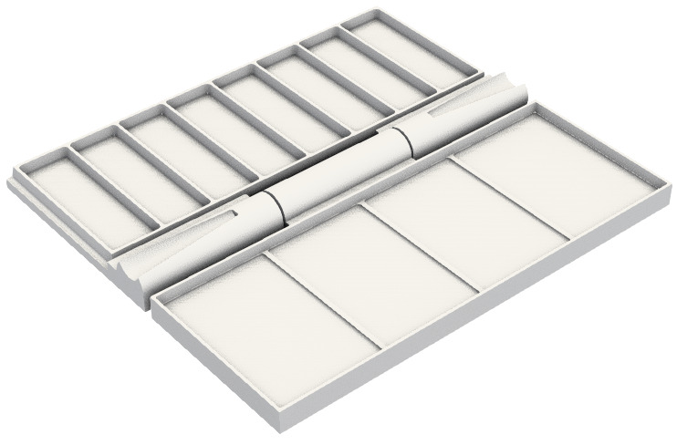

# The Muddy Waters mini travel watercolour palette

Because nothing says "I'm an artist having a mid life crisis" than endlessly trying to
optimise your equipment rather than just doing a painting.



Features:

 - Wells for paint
 - Wells for mixing
 - A hinged clamshell design
 - A little notch for holding the palette to your sketchbook with a rubber band

## Building

This is a parametric (customisable) model, build using the fantastic [build123d](https://github.com/gumyr/build123d) - a Python library which will run on anything that can run Python.

Check the Python version requirements, but as of the time of writing, the release in PyPI required Python 3.7-3.13 and did not support 3.14.

```
git clone https://github.com/mrmonkington/muddywaters.git
cd muddywaters
python -mvenv .venv
.venv/bin/pip install build123d
.venv/bin/python palette.py
```

This will generate `palette_build123d.stl` which you can drop into your favourite slicer.

### Slicing settings

Print it flat on its back - the hinge is print in place and the overhang angles are such that the hinge doesn't collapse.

I am using a crummy old Monoprice Select Mini V2 and found I got good results in Ultimaker Cura with:

  - 0.17mm resolution ("normal")
  - 50% cooling
  - 22% infill (grid was fine)
  - 65C bed
  - no adhesion (for a smoother face) or supports
  - regular speed (50mm)
  - slightly notched back first layer speed of 25mm

The main challenge is convincing a large flat model to stay stuck to the bed and not curl up at the edges. Print in a warm room and consider a bit of glue on the bed.

You'll have to use a little force to free up the hinge. If you find the model flexes too much to do this, you may have to print with thicker walls/more infill.

## Customisation

There are lots of variables to play with!

The simplest is to change the well count `well_count`, which should be a multiple of whatever `wells_per_mixer` is. e.g. You could have `well_count` of 9 and `wells_per_mixer` of 3, to give 3 mixing wells.

I haven't been very clever calculating taper angles and if you drastically change some variables the tapered sections may self-intersect.
